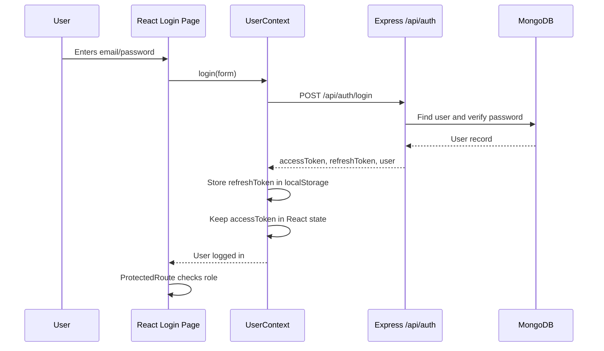

# Project Flowchart

Use this as the mental map for the codebase.

## Full App Flow

```mermaid
flowchart TD
  Start([User opens website]) --> Vite[React/Vite Frontend]
  Vite --> Router[src/App.jsx routes]

  Router --> PublicPages[Public pages]
  PublicPages --> Home[/home1, /home2, /home4]
  PublicPages --> About[/about]
  PublicPages --> Services[/services]
  PublicPages --> Portfolio[/portfolio]
  PublicPages --> Contact[/contact]
  PublicPages --> Login[/login]
  PublicPages --> Register[/register]

  Router --> Protected[Protected portal routes]
  Protected --> UserContext[src/context/UserContext.jsx]
  UserContext --> HasUser{User logged in?}

  HasUser -- No --> AccessDenied[Access denied / login needed]
  HasUser -- Yes --> RoleCheck{Role allowed?}

  RoleCheck -- No --> AccessDenied
  RoleCheck -- Yes --> PortalPages[Portal page opens]

  PortalPages --> Admin[/portals/admin]
  PortalPages --> Client[/portals/client]
  PortalPages --> Manager[/portals/project]
  PortalPages --> Team[/portals/employee]
  PortalPages --> CRM[/portals/crm]
  PortalPages --> Billing[/portals/billing]

  Vite --> APIConfig[src/config.js]
  APIConfig --> APIBase{VITE_API_URL set?}
  APIBase -- Yes --> CustomAPI[Use VITE_API_URL]
  APIBase -- No, dev --> LocalAPI[http://localhost:5000/api]
  APIBase -- No, prod --> RenderAPI[Render backend API]

  CustomAPI --> Backend
  LocalAPI --> Backend
  RenderAPI --> Backend

  Backend[Express Backend: backend/server.js] --> Middleware[Security, CORS, rate limit, JSON parsing]
  Middleware --> Routes[Backend routes]

  Routes --> Auth[/api/auth]
  Routes --> Leads[/api/leads]
  Routes --> Projects[/api/projects]
  Routes --> Tasks[/api/tasks]
  Routes --> ContactAPI[/api/contact]
  Routes --> Health[/api/health]
  Routes --> OtherAPIs[AI, appointments, billing, communications, users]

  Backend --> DBConnect[backend/config/database.js]
  DBConnect --> Mongo[(MongoDB)]

  Auth --> Models[MongoDB models]
  Leads --> Models
  Projects --> Models
  Tasks --> Models
  Models --> Mongo
```

## Login Flow



## Portal Access Flow

```mermaid
flowchart TD
  Route[User opens /portals/... route] --> ProtectedRoute[src/components/ProtectedRoute.jsx]
  ProtectedRoute --> Loading{Auth loading?}
  Loading -- Yes --> LoadingScreen[Show loading screen]
  Loading -- No --> LoggedIn{User exists?}

  LoggedIn -- No --> Denied[Access denied]
  LoggedIn -- Yes --> RoleAllowed{User role in allowedRoles?}

  RoleAllowed -- No --> Denied
  RoleAllowed -- Yes --> CodeGate{PortalCodeGate needed?}

  CodeGate -- No --> OpenPortal[Open portal]
  CodeGate -- Yes --> GateUnlocked{Session storage unlocked?}

  GateUnlocked -- No --> PortalDashboard[/portals dashboard]
  GateUnlocked -- Yes --> OpenPortal
```

## Backend Request Flow

```mermaid
flowchart LR
  Request[Browser/API request] --> Server[backend/server.js]
  Server --> Helmet[helmet security headers]
  Helmet --> CORS[CORS check]
  CORS --> RateLimit[rate limit on /api]
  RateLimit --> Parser[JSON/body parser]
  Parser --> Route[Matching route file]

  Route --> PublicRoute{Needs auth?}
  PublicRoute -- No --> Controller[Route handler]
  PublicRoute -- Yes --> AuthMiddleware[authMiddleware]
  AuthMiddleware --> RoleMiddleware[roleMiddleware if needed]
  RoleMiddleware --> Controller

  Controller --> Model[Mongoose model]
  Model --> Mongo[(MongoDB)]
  Mongo --> Response[JSON response]
```



## Main Files To Read First

1. `src/App.jsx` - frontend page and portal routing.
2. `src/context/UserContext.jsx` - login, token refresh, logout, authenticated fetch.
3. `src/components/ProtectedRoute.jsx` - role-based portal access.
4. `src/config.js` - frontend backend API URL.
5. `backend/server.js` - backend app setup and route mounting.
6. `backend/config/database.js` - MongoDB connection.
7. `backend/routes/auth.js` - register, login, token refresh.
8. `backend/models/User.js` - user shape in MongoDB.

## Current Gaps To Remember

- Frontend calls `GET /api/services`, but backend does not define it yet.
- Frontend calls `GET /api/portfolio`, but backend does not define it yet.
- Some portal pages use relative Axios URLs like `/api/tasks`; these should eventually use the shared API config.
